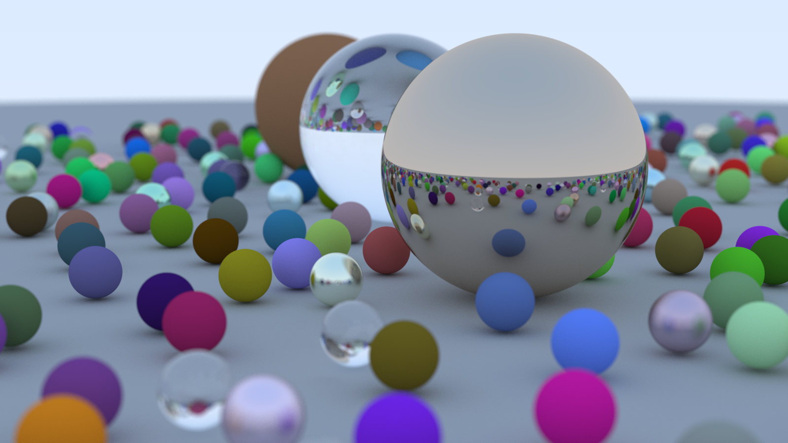
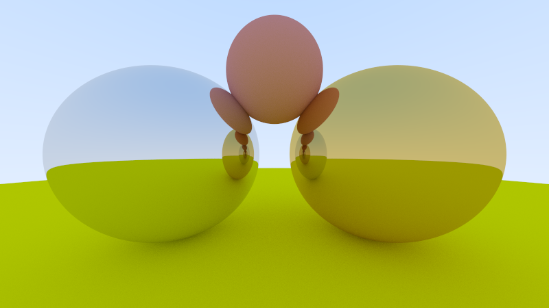
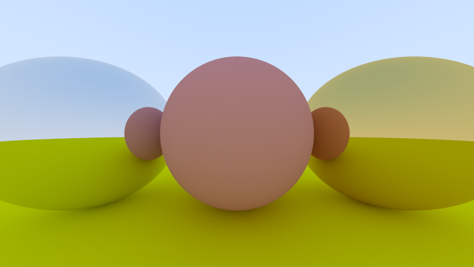
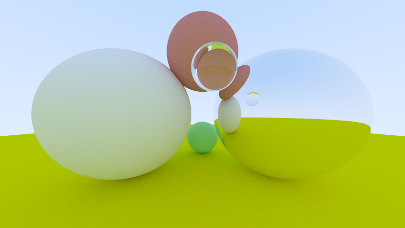

# RayTracing in C++

## Description
This is a ray tracing program written in C++. 
Support for geometry objects including sphere, and triangle mesh.
Support for material including lambertian, metal, and dielectric.
Support for camera refocusing, and aperture tweaking.

## Result

