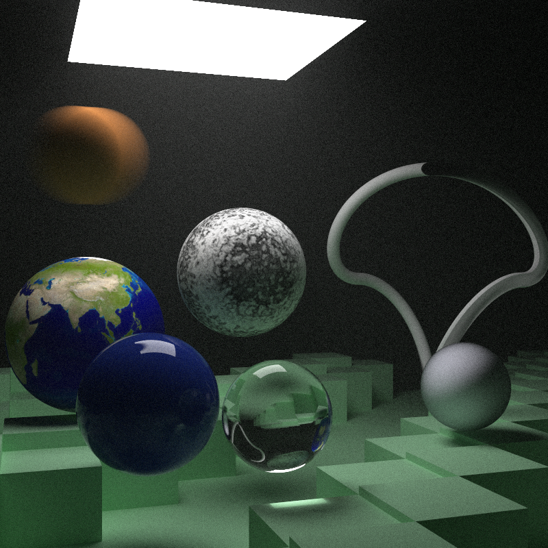

# RayTracing in C++

## Description
This is a ray tracing program written in C++. 
Support for geometry objects including sphere, and triangle mesh.
Support for material_base including lambertian, metal, and dielectric.
Support for camera refocusing, and aperture tweaking.

## Result

[//]: # (![result]&#40;./learning/ray_tracing_mirror_metal_lambertian_fancy.png&#41;)
[//]: # (![result2]&#40;./learning/ray_tracing_mirror_metal_lambertian.png&#41;)
[//]: # (![result3]&#40;./learning/glass_ball.png&#41;)

## References
- [Ray Tracing in One Weekend](https://raytracing.github.io/books/RayTracingInOneWeekend.html)
- [Ray Tracing: The Next Week](https://raytracing.github.io/books/RayTracingTheNextWeek.html)
- [Ray Tracing: The Rest Of Your Life](https://raytracing.github.io/books/RayTracingTheRestOfYourLife.html)